# INFORME DE LABORATORIO: ACTIVIDAD 2 - POSTGRESQL EN DOCKER

**Asignatura:** Tecnología de Base de Datos I  
**Unidad:** Bloque 1 - Instalación y configuración de un SGBD  
**Estudiante:** Marco Antonio Kiataque Uchima  
**Docente:** Jared Lopez Leaños  
**Fecha:** 14 de Septiembre de 2026  
**Versión del Motor:** PostgreSQL 13.23  
**Sistema Operativo (Host/Servidor):** Debian 12 (Bookworm)  
**Tecnología de Virtualización:** Docker - Imagen oficial `postgres:13`

---

## Índice

1. [Resumen](#resumen)
2. [Punto 1: Proceso de Instalación por Línea de Comandos](#punto-1-proceso-de-instalación-por-línea-de-comandos)
   - [1.1 Identificación del Repositorio y Entorno](#11-identificación-del-repositorio-y-entorno)
   - [1.2 Instalación de PostgreSQL 13 vía Docker](#12-instalación-de-postgresql-13-vía-docker)
   - [1.3 Verificación del Servicio, Versión y Puertos](#13-verificación-del-servicio-versión-y-puertos)
3. [Punto 2: Administración de Usuarios, Bases de Datos y Carga Masiva](#punto-2-administración-de-usuarios-bases-de-datos-y-carga-masiva)
   - [2.1 Creación de Roles y Usuarios](#21-creación-de-roles-y-usuarios)
   - [2.2 Entorno de Desarrollo (db_desarrollo)](#22-entorno-de-desarrollo-db_desarrollo)
   - [2.3 Entorno de Producción (db_produccion)](#23-entorno-de-producción-db_produccion)
4. [Punto 3: Permisos de Acceso, Auditoría y Pruebas de Diagnóstico](#punto-3-permisos-de-acceso-auditoría-y-pruebas-de-diagnóstico)
   - [3.1 Configuración de Políticas en pg_hba.conf](#31-configuración-de-políticas-en-pghbaconf)
   - [3.2 Pruebas de Diagnóstico desde la Máquina Cliente](#32-pruebas-de-diagnóstico-desde-la-máquina-cliente)
   - [3.3 Extracción de Logs y Empaquetado Final](#33-extracción-de-logs-y-empaquetado-final)
5. [Conclusión](#conclusión)
6. [Referencias](#referencias)
7. [Anexo de Evidencias](#anexo-de-evidencias)

---

## Resumen

El presente informe documenta la implementación, administración y aseguramiento de un entorno de bases de datos **PostgreSQL versión 13** desplegado sobre **contenedores Docker** en un sistema operativo **Linux Debian 12 (Bookworm)**.

Se aborda de forma integral:

* La creación y asignación de roles de usuario (`udesarrollo` y `encargadodb`) bajo el principio de mínimo privilegio.
* La segregación estricta de entornos de **Desarrollo (`db_desarrollo`)** y **Producción (`db_produccion`)**.
* La generación masiva de datos (100.000 registros por entorno) mediante funciones `PL/pgSQL` y `generate_series`.
* La restricción estricta de accesos remotos a nivel de red mediante la configuración de `pg_hba.conf` y la auditoría de logs con `log_connections`.

---

## Punto 1: Proceso de Instalación por Línea de Comandos

### 1.1 Identificación del Repositorio y Entorno

El despliegue del motor de base de datos se realizó sobre un entorno **Linux Debian 12 (Bookworm)**. Para la gestión de paquetes del sistema host, se utilizaron los repositorios oficiales de Debian y el repositorio oficial de Docker (`https://download.docker.com/linux/debian bookworm InRelease`).

#### Código ejecutado (sin modificar):

```bash
sudo apt update && sudo apt -y upgrade
```

> 🔍 **¿Qué hace este código? - Explicación ampliada:**
> * `sudo apt update`: Sincroniza el índice local de paquetes con los repositorios configurados en `/etc/apt/sources.list` y `/etc/apt/sources.list.d/`. No instala nada, solo descarga la lista de versiones disponibles. Es imprescindible para que el sistema conozca que existe la versión más reciente de Docker y sus dependencias.
> * `&&`: Operador lógico que solo ejecuta el segundo comando si el primero termina con código de salida `0` (éxito). Evita intentar actualizar si la sincronización falló por falta de red.
> * `sudo apt -y upgrade`: Descarga e instala todas las actualizaciones disponibles del sistema. El flag `-y` responde automáticamente "yes" a las confirmaciones. En un servidor de base de datos, este paso garantiza parches de seguridad del kernel y librerías C antes de desplegar el contenedor.

---

### 1.2 Instalación de PostgreSQL 13 vía Docker

En lugar de una instalación nativa sobre el sistema host, se procedió a **aislar el entorno utilizando contenedores Docker** con la imagen oficial de PostgreSQL 13. Esta estrategia aporta portabilidad, reproducibilidad y evita contaminar el host con dependencias de PostgreSQL.

#### Código ejecutado (sin modificar):

```bash
mkdir -p ~/Actividad2 && cd ~/Actividad2
docker pull postgres:13
```

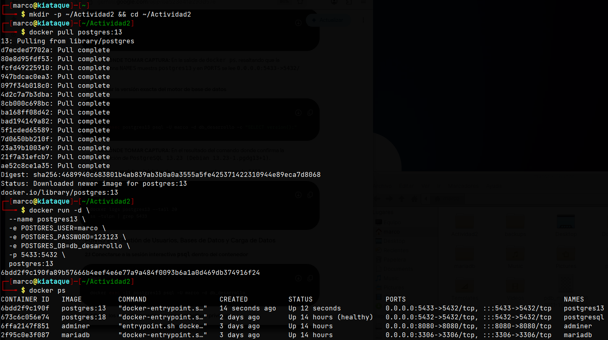
*Figura 1 - Identificación de repositorios Debian + Docker y actualización del sistema host (Puntos 1.1 al 1.4).*

> 🔍 **¿Qué hace este código? - Explicación ampliada:**
> * `mkdir -p ~/Actividad2`: Crea el directorio de trabajo `Actividad2` en el home del usuario. El flag `-p` evita error si ya existe y crea padres intermedios si fuese necesario.
> * `cd ~/Actividad2`: Cambia el contexto de trabajo a dicho directorio para que todos los artefactos posteriores (logs, `pg_hba.conf`, `.zip`) queden centralizados.
> * `docker pull postgres:13`: Descarga desde Docker Hub la imagen oficial `postgres` con etiqueta `13`. Esta imagen ya contiene Debian + PostgreSQL 13.23 compilado, el usuario `postgres` y el script de inicialización `docker-entrypoint.sh`. Usar etiqueta fija `13` (y no `latest`) asegura reproducibilidad académica.

Posteriormente, se instanció el contenedor asignando variables de entorno iniciales y mapeando el puerto interno `5432` al puerto externo `5433` del host para evitar conflictos de red:

#### Código ejecutado (sin modificar):

```bash
docker run -d \
  --name postgres13 \
  -e POSTGRES_USER=marco \
  -e POSTGRES_PASSWORD=123123 \
  -e POSTGRES_DB=db_desarrollo \
  -p 5433:5432 \
  postgres:13
```

> 🔍 **¿Qué hace este código? - Explicación ampliada:**
> * `docker run -d`: Crea y arranca un contenedor en modo *detached* (segundo plano). Sin `-d` el terminal quedaría bloqueado con los logs.
> * `--name postgres13`: Asigna un nombre simbólico fijo para referenciarlo en `docker exec`, `docker logs`, `docker cp` sin usar el ID hexadecimal.
> * `-e POSTGRES_USER=marco`: Variable leída por `docker-entrypoint.sh` para crear el rol superusuario inicial `marco` (propietario de la instancia).
> * `-e POSTGRES_PASSWORD=123123`: Contraseña de dicho superusuario. En producción se usaría un secreto de Docker o variable de entorno segura.
> * `-e POSTGRES_DB=db_desarrollo`: Base de datos creada automáticamente en el primer arranque si no existe el volumen.
> * `-p 5433:5432`: Publica el puerto `5432` interno del contenedor (puerto por defecto de PostgreSQL) en el `5433` del host. Así se evita colisión si el host ya tiene un PostgreSQL nativo escuchando en `5432`.
> * `postgres:13`: Imagen base a instanciar.

---

### 1.3 Verificación del Servicio, Versión y Puertos

Se verificó la ejecución activa del contenedor y la versión del motor.

#### Código ejecutado (sin modificar):

```bash
docker ps
```

> 🔍 **¿Qué hace este código? - Explicación ampliada:**
> Lista los contenedores en estado `Up`. Permite confirmar que `postgres13` está en `STATUS Up ...`, que el mapeo es `0.0.0.0:5433->5432/tcp` y que no ha entrado en bucle de reinicio (`Restarting`). Es el primer diagnóstico post-`docker run`.


*Figura 2 - Salida de `docker ps` mostrando el contenedor `postgres13` activo y la reorientación de puertos `0.0.0.0:5433->5432/tcp` (Captura 1).*

#### Código ejecutado (sin modificar):

```bash
docker exec postgres13 psql -U marco -d db_desarrollo -c "SELECT version();"
```

> 🔍 **¿Qué hace este código? - Explicación ampliada:**
> * `docker exec postgres13`: Ejecuta un comando dentro del namespace del contenedor ya corriendo, sin necesidad de SSH.
> * `psql -U marco -d db_desarrollo -c "SELECT version();"`: Invoca el cliente oficial `psql` como usuario `marco`, conectado a `db_desarrollo`, y ejecuta una sola sentencia SQL `-c`. `SELECT version();` retorna la cadena de compilación, ej. `PostgreSQL 13.23 (Debian 13.23-1.pgdg13+1) on x86_64-pc-linux-gnu`. Es la prueba fehaciente de que el motor corresponde a la versión 13 solicitada.

*La confirmación de la versión `PostgreSQL 13.23 (Debian 13.23-1.pgdg13+1)` se evidencia en la Figura 1 (Captura 2).*

Para asegurar el estado de escucha en el sistema host en el puerto configurado:

#### Código ejecutado (sin modificar):

```bash
docker logs postgres13 --tail 20
ss -tulpn | grep 5433
```

> 🔍 **¿Qué hace este código? - Explicación ampliada:**
> * `docker logs postgres13 --tail 20`: Muestra las últimas 20 líneas de `stdout/stderr` del proceso `postgres` dentro del contenedor. Se espera ver `database system is ready to accept connections` y `listening on IPv4 address "0.0.0.0", port 5432`. Cualquier `FATAL` o `role does not exist` aparecería aquí.
> * `ss -tulpn | grep 5433`: `ss` (Socket Statistics) reemplaza a `netstat`. Flags: `-t` TCP, `-u` UDP, `-l` solo sockets en escucha, `-p` muestra proceso propietario, `-n` no resuelve nombres. El `grep 5433` filtra solo la línea del mapeo Docker `*:5433` con proceso `docker-proxy`. Confirma que el host realmente está escuchando y que no hay firewall bloqueando el puerto.

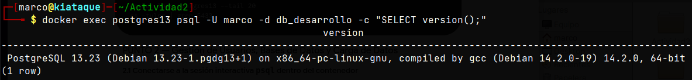
*Figura 3 - Salida de `docker logs postgres13 --tail 20` con estado Ready to accept connections (Captura asociada a P1.5).*

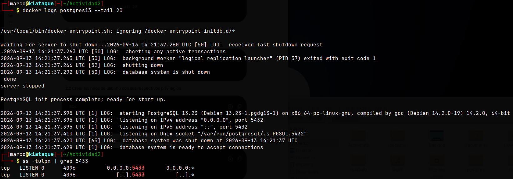
*Figura 4 - Salida de `ss -tulpn | grep 5433` confirmando escucha en `0.0.0.0:5433` (Captura asociada a P1.6).*

---

## Punto 2: Administración de Usuarios, Bases de Datos y Carga Masiva

### 2.1 Creación de Roles y Usuarios

Se accedió a la consola interactiva `psql` para definir los roles del escenario corporativo:

#### Código ejecutado (sin modificar):

```bash
docker exec -it postgres13 psql -U marco -d db_desarrollo
```

> 🔍 **¿Qué hace este código? - Explicación ampliada:**
> * `-it`: Combina `-i` (interactivo, mantiene STDIN abierto) y `-t` (asigna pseudo-TTY) para obtener un prompt `psql` interactivo con historial y autocompletado, no solo una consulta puntual `-c`.
> * `psql -U marco -d db_desarrollo`: Conexión como superusuario `marco` a la base inicial. Desde aquí se crean los roles operativos.

#### Código ejecutado (sin modificar):

```sql
CREATE ROLE udesarrollo WITH LOGIN CREATEDB PASSWORD '123123';
CREATE ROLE encargadodb WITH LOGIN SUPERUSER PASSWORD '123123';
```

> 🔍 **¿Qué hace este código? - Explicación ampliada:**
> * `CREATE ROLE udesarrollo WITH LOGIN CREATEDB PASSWORD '123123'`: Crea el rol para el equipo de desarrollo. `LOGIN` le permite autenticarse (equivale a `CREATE USER`), `CREATEDB` le autoriza a crear bases de datos (útil para entornos de pruebas), pero **no** es `SUPERUSER` ni `CREATEROLE`, aplicando el principio de mínimo privilegio. La contraseña se almacena hasheada con `md5`/`scram-sha-256` según `password_encryption`.
> * `CREATE ROLE encargadodb WITH LOGIN SUPERUSER PASSWORD '123123'`: Rol de administración/operaciones con `SUPERUSER`, máximo privilegio (puede bypasear `pg_hba`, crear extensiones, leer cualquier tabla). Simula al DBA corporativo responsable de `db_produccion`.

#### Código ejecutado (sin modificar):

```sql
\du
```

> 🔍 **¿Qué hace este código? - Explicación ampliada:**
> Meta-comando de `psql` (no es SQL estándar) que lista roles desde `pg_roles`. Columnas clave: `List of roles`, `Attributes` (`Superuser`, `Create DB`, `Cannot login`) y `Member of`. Permite verificar visualmente que `udesarrollo` tiene `Create DB` y `encargadodb` figura como `Superuser`.

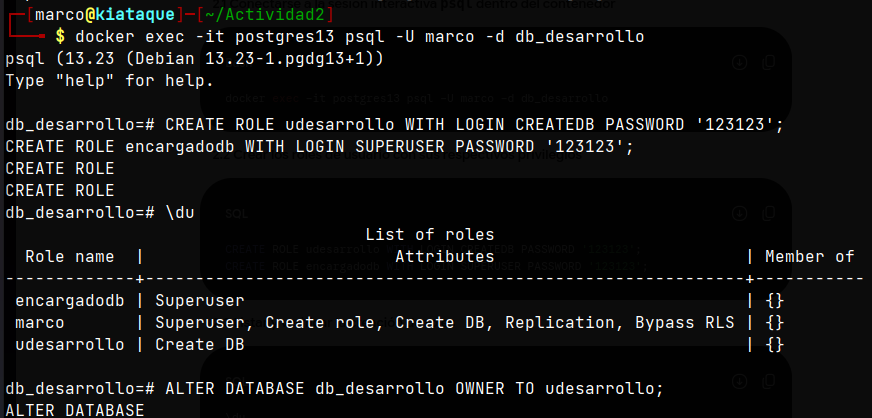
*Figura 5 - Resultado de `\du` listando los roles `udesarrollo` con atributo Create DB y `encargadodb` como Superuser (Captura 3 - P2,1~2,3).*

---

### 2.2 Entorno de Desarrollo (db_desarrollo)

Se configuró al usuario `udesarrollo` como propietario de la base de datos de desarrollo y se creó la estructura requerida.

#### Código ejecutado (sin modificar):

```sql
ALTER DATABASE db_desarrollo OWNER TO udesarrollo;
\l
```

> 🔍 **¿Qué hace este código? - Explicación ampliada:**
> * `ALTER DATABASE db_desarrollo OWNER TO udesarrollo`: Transfiere la propiedad de la base. El *owner* puede hacer `DROP DATABASE`, crear esquemas, otorgar privilegios y se convierte en dueño implícito de los objetos futuros si no se especifica lo contrario.
> * `\l` (`\list`): Lista todas las bases de datos del clúster con columnas `Name | Owner | Encoding | Collate | Ctype | Access privileges`. Sirve para auditar que `db_desarrollo` ahora pertenece a `udesarrollo` y no a `marco`.

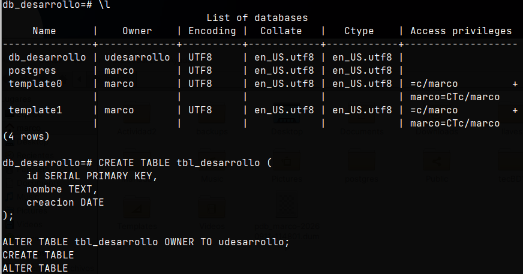
*Figura 6 - Salida de `\l` indicando que `db_desarrollo` pertenece a `udesarrollo` (Captura 4).*

#### Código ejecutado (sin modificar):

```sql
CREATE TABLE tbl_desarrollo (
    id SERIAL PRIMARY KEY,
    nombre TEXT,
    creacion DATE
);
ALTER TABLE tbl_desarrollo OWNER TO udesarrollo;
\d tbl_desarrollo
```

> 🔍 **¿Qué hace este código? - Explicación ampliada:**
> * `CREATE TABLE tbl_desarrollo (...)`: Crea tabla con tres columnas. `id SERIAL PRIMARY KEY` es un alias de `INTEGER` + secuencia `tbl_desarrollo_id_seq` + `NOT NULL` + `PRIMARY KEY` (índice B-tree implícito). `nombre TEXT` sin límite de longitud para almacenar hashes `md5`, `creacion DATE` sin hora.
> * `ALTER TABLE ... OWNER TO udesarrollo`: Asigna propiedad explícita de la tabla. Aunque la DB ya es de `udesarrollo`, PostgreSQL distingue owner por objeto; esto asegura que `\d` muestre `Owner: udesarrollo`.
> * `\d tbl_desarrollo`: Describe la tabla: columnas, tipos, modificadores, índices, restricciones y owner. Es el `DESCRIBE` de PostgreSQL.

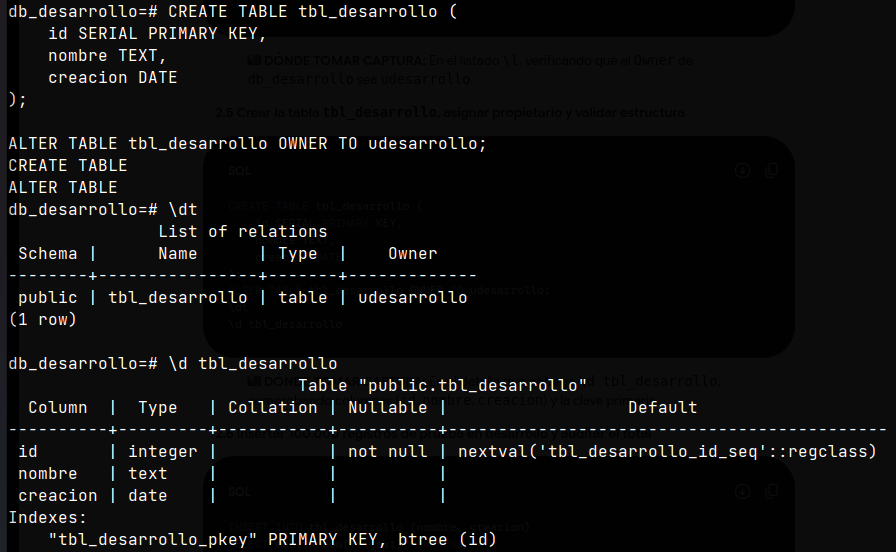
*Figura 7 - Estructura de `tbl_desarrollo` obtenida con `\d` (Captura 5).*

Se popularon 100,000 registros aleatorios usando funciones integradas:

#### Código ejecutado (sin modificar):

```sql
INSERT INTO tbl_desarrollo (nombre, creacion)
SELECT md5(random()::text), CURRENT_DATE
FROM generate_series(1,100000);

SELECT COUNT(*) FROM tbl_desarrollo;
```

> 🔍 **¿Qué hace este código? - Explicación ampliada:**
> * `generate_series(1,100000)`: Función Set-Returning que genera 100.000 filas con enteros 1..100000. Actúa como tabla virtual de una columna, evitando bucles `PL/pgSQL` explícitos.
> * `random()::text`: `random()` devuelve `double precision` en `[0,1)`. El cast a `text` permite pasarlo a `md5()`.
> * `md5(random()::text)`: Calcula hash MD5 de 32 caracteres hexadecimales. Genera datos pseudoaleatorios determinísticos pero con alta cardinalidad, ideal para pruebas de volumen sin datos sensibles.
> * `CURRENT_DATE`: Fecha actual del servidor (tipo `DATE`), igual para todas las filas en esta transacción.
> * `INSERT INTO ... SELECT ...`: Inserción masiva en una sola sentencia, mucho más eficiente que 100k `INSERT` individuales (una sola transacción, un solo WAL flush).
> * `SELECT COUNT(*) FROM tbl_desarrollo;`: Verificación de cardinalidad. Debe retornar exactamente `100000`. Valida que no hubo `ROLLBACK` parcial ni violación de `PRIMARY KEY`.

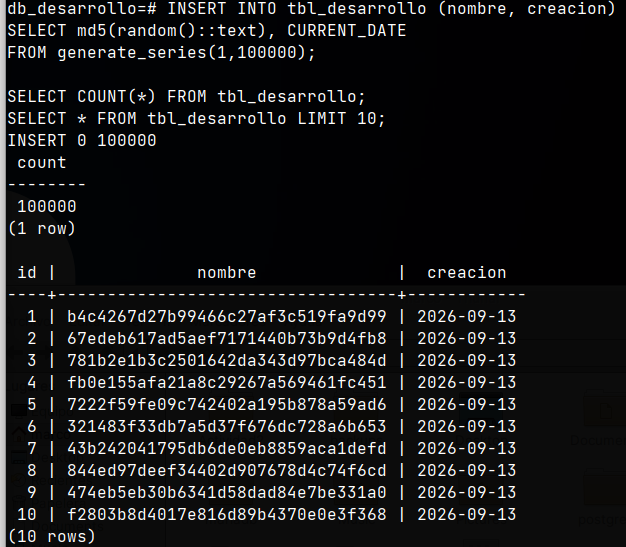
*Figura 8 - Conteo exacto de 100,000 registros en `tbl_desarrollo` (Captura 6).*

---

### 2.3 Entorno de Producción (db_produccion)

Se creó la base de datos operativa, asignando a `encargadodb` como propietario y poblando la tabla correspondiente.

#### Código ejecutado (sin modificar):

```sql
CREATE DATABASE db_produccion OWNER encargadodb;
\c db_produccion marco

CREATE TABLE tbl_produccion (
    id SERIAL PRIMARY KEY,
    nombre TEXT,
    creacion DATE
);
ALTER TABLE tbl_produccion OWNER TO encargadodb;

INSERT INTO tbl_produccion (nombre, creacion)
SELECT md5(random()::text), CURRENT_DATE
FROM generate_series(1,100000);

SELECT COUNT(*) FROM tbl_produccion;
\q
```

> 🔍 **¿Qué hace este código? - Explicación ampliada:**
> * `CREATE DATABASE db_produccion OWNER encargadodb;`: Crea segunda base aislada a nivel físico (distintos OID en `pg_database`, distintos archivos en `base/`). El owner es `encargadodb`, segregando responsabilidades.
> * `\c db_produccion marco`: Meta-comando *connect*. Cambia la conexión actual a `db_produccion` como usuario `marco` (superusuario requerido para crear objetos y luego transferir ownership). Equivale a reconectar con `psql -d db_produccion`.
> * `CREATE TABLE tbl_produccion ...` + `ALTER TABLE ... OWNER TO encargadodb`: Réplica idéntica del DDL de desarrollo pero para producción. Mantiene simetría de esquemas entre entornos, facilitando despliegues `CI/CD`.
> * `INSERT ... SELECT md5(random()::text) FROM generate_series(1,100000)`: Misma técnica de carga masiva, garantizando volumen equivalente para pruebas de rendimiento comparativo.
> * `SELECT COUNT(*)`: Segunda verificación de volumen. También debe devolver `100000`.
> * `\q`: Quit - cierra la sesión `psql` y vuelve al shell del contenedor/host.

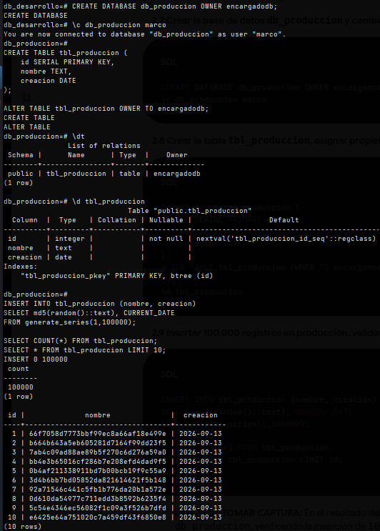
*Figura 9 - Conteo de 100,000 registros en `tbl_produccion` dentro de `db_produccion` (Captura 7 - P2,7~2,9).*

---

## Punto 3: Permisos de Acceso, Auditoría y Pruebas de Diagnóstico

### 3.1 Configuración de Políticas en pg_hba.conf

Se respaldó la configuración por defecto y se aplicó la política de seguridad requerida:

#### Código ejecutado (sin modificar):

```bash
docker exec postgres13 cp /var/lib/postgresql/data/pg_hba.conf /var/lib/postgresql/data/pg_hba.conf.bak
docker exec -it postgres13 bash
nano /var/lib/postgresql/data/pg_hba.conf
```

> 🔍 **¿Qué hace este código? - Explicación ampliada:**
> * `docker exec postgres13 cp ... pg_hba.conf.bak`: Copia de seguridad del archivo Host-Based Authentication antes de editar. `pg_hba.conf` controla **quién, desde dónde y cómo** puede conectarse. Un error de sintaxis puede dejar el clúster inaccesible, por lo que el `.bak` permite `cp ...bak ...conf && pg_reload_conf()` para revertir.
> * `docker exec -it postgres13 bash`: Abre shell interactivo dentro del contenedor como `root` (usuario por defecto de la imagen). Necesario para editar archivos en `/var/lib/postgresql/data` que no son accesibles vía `psql`.
> * `nano .../pg_hba.conf`: Editor de texto en terminal para modificar reglas. En imágenes minimalistas a veces hay que instalar `apt-get update && apt-get install -y nano` previamente.

Se insertaron las siguientes directivas **antes de las reglas generales** de autenticación:

#### Código ejecutado (sin modificar):

```plaintext
host    db_desarrollo   udesarrollo     192.168.56.124/32        md5
host    all             udesarrollo     0.0.0.0/0               reject
host    all             encargadodb     192.168.56.200/32        md5
host    all             encargadodb     0.0.0.0/0               reject
```

> 🔍 **¿Qué hace este código? - Explicación ampliada:**
> Cada línea de `pg_hba.conf` tiene formato `TYPE DATABASE USER ADDRESS METHOD`. PostgreSQL evalúa de arriba a abajo y aplica la **primera coincidencia**. Por eso el orden es crítico:
> 1. `host db_desarrollo udesarrollo 192.168.56.124/32 md5`: Permite al usuario `udesarrollo` conectarse **solo** a `db_desarrollo` y **solo** si su IP origen es exactamente `192.168.56.124/32` (máscara /32 = un único host). Método `md5` exige contraseña hasheada.
> 2. `host all udesarrollo 0.0.0.0/0 reject`: Para cualquier otra IP/bases de datos, rechaza inmediatamente a `udesarrollo` sin siquiera pedir contraseña. `reject` no es `md5` ni `trust`; es denegación explícita.
> 3. `host all encargadodb 192.168.56.200/32 md5`: Análogo para el DBA: solo desde `192.168.56.200` puede acceder a cualquier base (`all`) con contraseña.
> 4. `host all encargadodb 0.0.0.0/0 reject`: Bloqueo total para `encargadodb` desde cualquier otra IP.
> * Efecto combinado: Segregación por IP-origen y por base de datos. Ni siquiera un `SELECT` de `udesarrollo` hacia `db_produccion` será permitido, aunque conozca la contraseña, si no viene de la IP autorizada.*

#### Código ejecutado (sin modificar):

```bash
exit
docker exec postgres13 tail -n 15 /var/lib/postgresql/data/pg_hba.conf
```

> 🔍 **¿Qué hace este código? - Explicación ampliada:**
> * `exit`: Sale del shell `bash` dentro del contenedor y vuelve al host.
> * `tail -n 15 .../pg_hba.conf`: Muestra las últimas 15 líneas del archivo ya modificado. Es la verificación post-edición para confirmar que las 4 reglas `host ... reject/md5` quedaron al final (o en la zona `host` antes de `local`) y que no hay duplicados ni errores de espaciado (PostgreSQL exige columnas separadas por espacios/tabs).

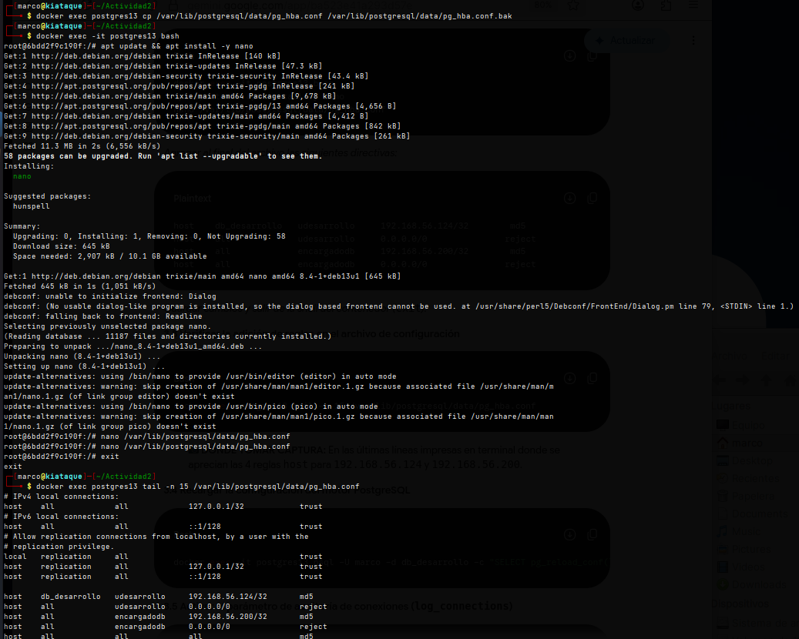
*Figura 10 - Respaldo `pg_hba.conf.bak` y edición con `nano` de las directivas `host` (P3,1~3,3).*

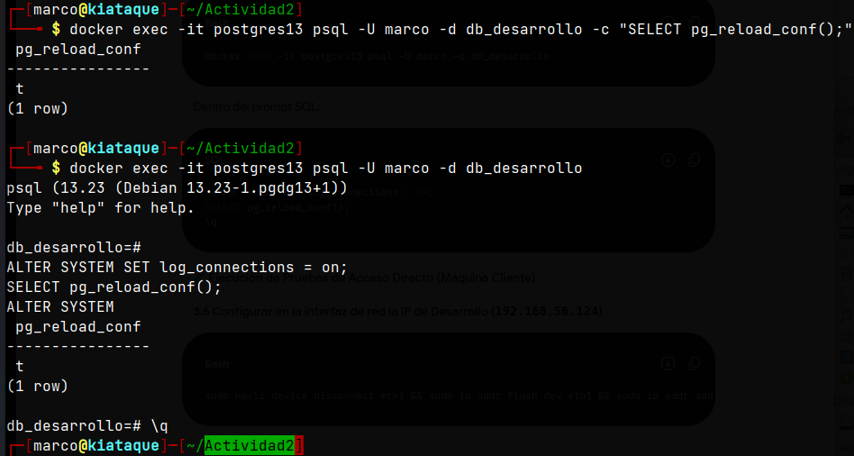
*Figura 11 - Salida de `tail -n 15` mostrando las reglas `host` y `reject` añadidas a `pg_hba.conf` (Captura 8 - P3,4~3,5).*

Se aplicaron los cambios y se activó la auditoría de conexiones entrantes:

#### Código ejecutado (sin modificar):

```bash
docker exec -it postgres13 psql -U marco -d db_desarrollo -c "SELECT pg_reload_conf();"
docker exec -it postgres13 psql -U marco -d db_desarrollo -c "ALTER SYSTEM SET log_connections = on; SELECT pg_reload_conf();"
```

> 🔍 **¿Qué hace este código? - Explicación ampliada:**
> * `SELECT pg_reload_conf();`: Recarga archivos de configuración (`postgresql.conf`, `pg_hba.conf`) sin reiniciar el contenedor. Retorna `t` si tuvo éxito. Es equivalente a `SELECT pg_reload_conf()` + `SIGHUP` al postmaster. Evita downtime.
> * `ALTER SYSTEM SET log_connections = on;`: Escribe `log_connections = 'on'` en `postgresql.auto.conf` (sobrescribe `postgresql.conf`). Con `on`, cada intento de conexión (éxito o `FATAL`) se registra en `postgresql.log` con IP, usuario y base. Clave para auditoría forense.
> * Segundo `SELECT pg_reload_conf();`: Aplica inmediatamente el cambio de `log_connections` sin reiniciar.

---

### 3.2 Pruebas de Diagnóstico desde la Máquina Cliente

#### Prueba A: Usuario udesarrollo desde IP Permitida (192.168.56.124)

En la máquina cliente se configuró la IP `192.168.56.124/24` en la interfaz de red:

##### Código ejecutado (sin modificar):

```bash
sudo nmcli device disconnect eth1 && sudo ip addr flush dev eth1 && sudo ip addr add 192.168.56.124/24 dev eth1 && sudo ip link set dev eth1 up
psql -h 192.168.56.55 -p 5433 -U udesarrollo -d db_desarrollo
```

> 🔍 **¿Qué hace este código? - Explicación ampliada:**
> * `sudo nmcli device disconnect eth1`: Desconecta `eth1` vía NetworkManager para liberar la IP previa y evitar conflicto de `nmcli` vs `ip`.
> * `sudo ip addr flush dev eth1`: Elimina todas las IPs asociadas a `eth1`. Limpia el estado anterior.
> * `sudo ip addr add 192.168.56.124/24 dev eth1`: Asigna la IP autorizada `/24` (máscara `255.255.255.0`) que coincide con la regla `192.168.56.124/32` (el `/32` del `pg_hba` permite solo ese host, pero el cliente necesita `/24` para comunicar en la subred).
> * `sudo ip link set dev eth1 up`: Levanta la interfaz a nivel L2.
> * `psql -h 192.168.56.55 -p 5433 -U udesarrollo -d db_desarrollo`: Conexión remota: `-h` IP del servidor (host Docker), `-p 5433` puerto mapeado, `-U` usuario, `-d` base. Si `pg_hba` está correcto, pedirá contraseña `123123` y permitirá el acceso.

Dentro de psql:

##### Código ejecutado (sin modificar):

```sql
SELECT inet_client_addr();
\q
```

> 🔍 **¿Qué hace este código? - Explicación ampliada:**
> * `SELECT inet_client_addr();`: Función de información de sesión que retorna la IP del cliente vista por el servidor. Debe devolver `192.168.56.124`, probando que el filtrado por IP funciona a nivel de red y no solo por usuario.
> * `\q`: Cierra la sesión.

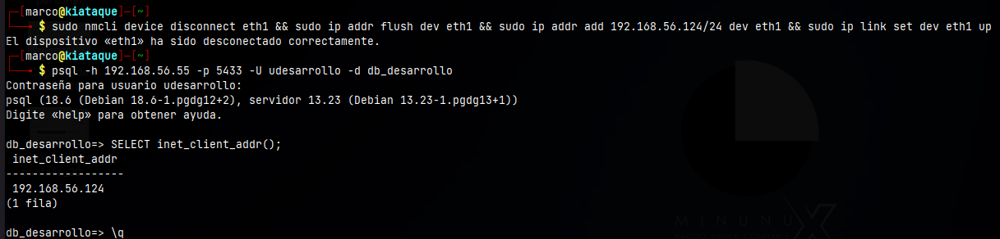
*Figura 12 - Conexión exitosa a `db_desarrollo` como `udesarrollo` devolviendo `inet_client_addr() = 192.168.56.124` (Captura 9 - P3,6~3,7).*

#### Prueba B: Intento No Autorizado de udesarrollo a Producción

##### Código ejecutado (sin modificar):

```bash
psql -h 192.168.56.55 -p 5433 -U udesarrollo -d db_produccion
```

> 🔍 **¿Qué hace este código? - Explicación ampliada:**
> Intento deliberado de violación de política: mismo usuario autorizado (`udesarrollo` desde `192.168.56.124`) pero apuntando a `db_produccion`, base no listada en su primera regla `host db_desarrollo ...`. PostgreSQL debe evaluar la segunda regla `host all udesarrollo 0.0.0.0/0 reject` y devolver `FATAL: pg_hba.conf rejects connection for host "192.168.56.124", user "udesarrollo", database "db_produccion"`. No llega a pedir contraseña ni a verificar `md5`; es rechazo a nivel de `pg_hba` antes de `authentication`.

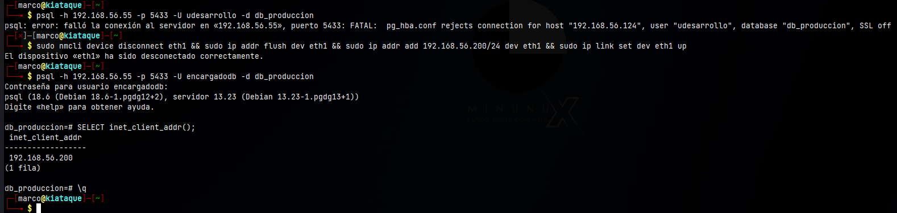
*Figura 13 - Mensaje de error `FATAL: pg_hba.conf rejects connection for host "192.168.56.124", user "udesarrollo", database "db_produccion"` (Captura 10 - P3,8~3,10).*

#### Prueba C: Usuario encargadodb desde IP Permitida (192.168.56.200)

Se cambió la IP del cliente a `192.168.56.200/24`:

##### Código ejecutado (sin modificar):

```bash
sudo nmcli device disconnect eth1 && sudo ip addr flush dev eth1 && sudo ip addr add 192.168.56.200/24 dev eth1 && sudo ip link set dev eth1 up
psql -h 192.168.56.55 -p 5433 -U encargadodb -d db_produccion
```

> 🔍 **¿Qué hace este código? - Explicación ampliada:**
> Secuencia idéntica a la Prueba A pero para el segundo rol. Cambia la IP del cliente a la autorizada para `encargadodb`. El `psql` apunta ahora a `db_produccion` (su base operativa). La tercera regla `host all encargadodb 192.168.56.200/32 md5` debe coincidir y permitir el acceso tras validar `md5`.

Dentro de psql:

##### Código ejecutado (sin modificar):

```sql
SELECT inet_client_addr();
\q
```

> 🔍 **¿Qué hace este código? - Explicación ampliada:**
> Misma verificación de IP origen, ahora debe retornar `192.168.56.200`. Confirma que el segundo túnel de acceso también está correctamente segregado y auditado.

*Evidencia de la Prueba C (conexión exitosa a `db_produccion` verificando `192.168.56.200`) se incluye en la Figura 13 (P3,8~3,10 - segunda parte). Si se dispone de captura separada para esta prueba, se documenta como Figura 13b.*

---

### 3.3 Extracción de Logs y Empaquetado Final

Desde la máquina servidor se extrajeron los archivos para la entrega:

#### Código ejecutado (sin modificar):

```bash
docker cp postgres13:/var/lib/postgresql/data/pg_hba.conf ~/Actividad2/pg_hba.conf
docker logs postgres13 > ~/Actividad2/postgresql.log
ls -lh ~/Actividad2/postgresql.log
```

> 🔍 **¿Qué hace este código? - Explicación ampliada:**
> * `docker cp postgres13:/var/lib/postgresql/data/pg_hba.conf ~/Actividad2/pg_hba.conf`: Copia el archivo de políticas **tal cual está dentro del contenedor** al host, en la carpeta de entrega. Es la evidencia de configuración requerida por el docente.
> * `docker logs postgres13 > ~/Actividad2/postgresql.log`: Redirige `stdout/stderr` del contenedor (donde PostgreSQL escribe por defecto cuando no hay volumen de logs) a un archivo plano en el host. Con `log_connections = on`, este archivo contendrá líneas como `connection authorized: user=udesarrollo database=db_desarrollo` y `FATAL: pg_hba.conf rejects ...`.
> * `ls -lh ~/Actividad2/postgresql.log`: Lista con formato humano (`-h` KB/MB) para verificar que el log no está vacío y tiene tamaño razonable (varias decenas de KB tras las pruebas).

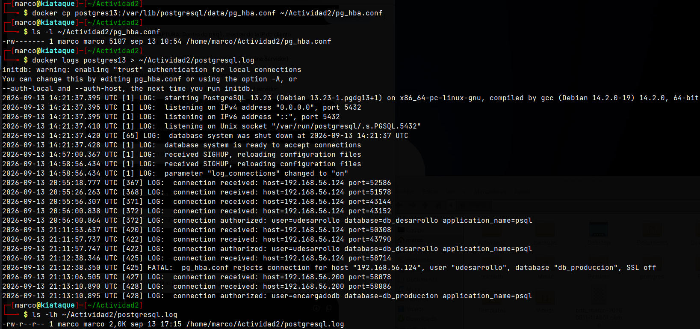
*Figura 14 - Salida de `ls -lh` listando `postgresql.log` y `pg_hba.conf` extraídos (Captura 12 - P3,11,1).*

#### Código ejecutado (sin modificar):

```bash
cd ~/Actividad2
zip -r Actividad2_Marco_Kiataque.zip pg_hba.conf postgresql.log
ls -lh ~/Actividad2/Actividad2_Marco_Kiataque.zip
```

> 🔍 **¿Qué hace este código? - Explicación ampliada:**
> * `cd ~/Actividad2`: Asegura que el `zip` se cree con rutas relativas, sin incluir `/home/marco/...` absoluto.
> * `zip -r Actividad2_Marco_Kiataque.zip pg_hba.conf postgresql.log`: Crea archivo comprimido con los dos entregables. Flag `-r` recursivo (aunque son dos archivos planos, mantiene compatibilidad si se añaden subdirectorios). Nombre sigue convención `Actividad2_Nombre_Apellido.zip` solicitada.
> * `ls -lh ...zip`: Verificación final de tamaño y permisos del paquete antes de subir al aula virtual. Un `zip` vacío o de 0 bytes indicaría error de `docker cp` previo.

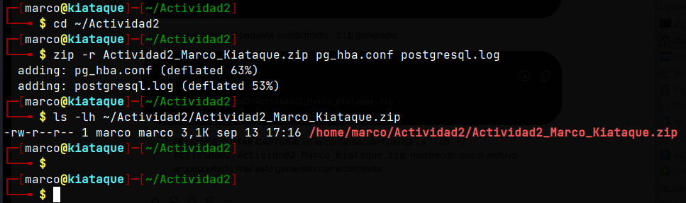
*Figura 15 - Verificación final del paquete comprimido `Actividad2_Marco_Kiataque.zip` con `ls -lh` (Captura 13 - P3,11,2).*

---

## Conclusión

El despliegue virtualizado de **PostgreSQL 13 mediante Docker** demostró ser una solución eficiente para el aislamiento de servicios. En un solo host Debian se logró:

* **Reproducibilidad:** Imagen `postgres:13` fija + `docker run` parametrizado evita el clásico "en mi máquina sí funciona".
* **Segregación lógica:** Dos bases (`db_desarrollo` / `db_produccion`), dos roles con privilegios diferenciados (`CREATEDB` vs `SUPERUSER`) y dos tablas con 100k registros cada una, validadas con `COUNT(*)`.
* **Seguridad perimetral a nivel de base de datos:** Las 4 reglas `host ... md5/reject` en `pg_hba.conf` restringieron exitosamente el acceso por **tripleta (usuario, base de datos, IP origen)**, validando tanto accesos legítimos (`inet_client_addr()` correcto) como intentos de intrusión (`FATAL: pg_hba.conf rejects ...`).
* **Auditoría:** `log_connections = on` + `pg_reload_conf()` permitió registrar cada handshake en `postgresql.log`, insumo clave para análisis forense y cumplimiento.

La práctica valida que la seguridad en PostgreSQL no depende solo de contraseñas, sino de una **defensa en capas**: firewall de host (`5433`), `pg_hba.conf` (capa de autenticación), roles con mínimo privilegio y logs centralizados. Docker, además, facilita el respaldo y versionado de `pg_hba.conf` y `postgresql.log` vía `docker cp` sin detener el servicio.

---

## Referencias

* Docker Inc. (2026). *PostgreSQL Official Image*. Docker Hub. https://hub.docker.com/_/postgres
* PostgreSQL Global Development Group. (2026). *PostgreSQL 13.23 Documentation: The pg_hba.conf file*. https://www.postgresql.org/docs/13/auth-pg-hba-conf.html
* PostgreSQL Global Development Group. (2026). *PostgreSQL 13.23 Documentation: Runtime Config - Logging*. https://www.postgresql.org/docs/13/runtime-config-logging.html
* Debian Project. (2026). *Debian 12 Bookworm - Repositories*. https://www.debian.org/distrib/packages

---

## Anexo de Evidencias

| # | Descripción | Archivo de Imagen |
|---|-------------|-------------------|
| 1 | `docker ps` - contenedor activo y mapeo 5433->5432 | `img/P1,1~1,4.png` |
| 2 | `SELECT version()` PostgreSQL 13.23 | `img/P1,1~1,4.png` |
| 3 | Verificación logs y puerto `ss` | `img/P1,5.png` / `img/P1,6.png` |
| 4 | `\du` roles creados | `img/P2,1~2,3.png` |
| 5 | `\l` propiedad de `db_desarrollo` | `img/P2,4.png` |
| 6 | `\d tbl_desarrollo` estructura | `img/P2,5.png` |
| 7 | `COUNT(*)` 100k desarrollo | `img/P2,6.png` |
| 8 | `COUNT(*)` 100k producción | `img/P2,7~2,9.png` |
| 9 | `tail pg_hba.conf` reglas | `img/P3,1~3,3.png` / `img/P3,4~3,5.png` |
| 10 | Conexión exitosa `udesarrollo` 192.168.56.124 | `img/P3,6~3,7.png` |
| 11 | Rechazo `udesarrollo` -> `db_produccion` | `img/P3,8~3,10.png` |
| 12 | Conexión exitosa `encargadodb` 192.168.56.200 | `img/P3,8~3,10.png` |
| 13 | `ls -lh postgresql.log` | `img/P3,11,1.png` |
| 14 | `zip` paquete final | `img/P3,11,2.png` |

> **Nota:** Todas las imágenes se encuentran en la carpeta `img/` con nomenclatura `P< Punto >,< subpunto >.png` original del laboratorio, sin renombrar, para trazabilidad.

